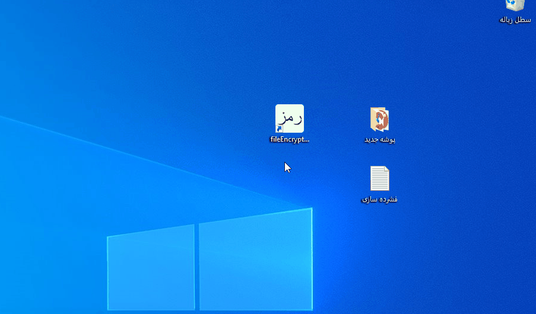

# fileEncryptor
می تواند هر پرونده را با (رمزگذاری پیشرفته استاندارد 256) رمزگذاری کند، و می تواند فایل ها و پوشه ها را در یک پرونده (زیپ فایل) فشرده سازی کند.

## fileEncryptor
This application can encrypy / decrypt files using AES 256, and it is also able to zip files and folders.

# Exhibits
## Encrypting & decrypting files

## Zipping files & folders
